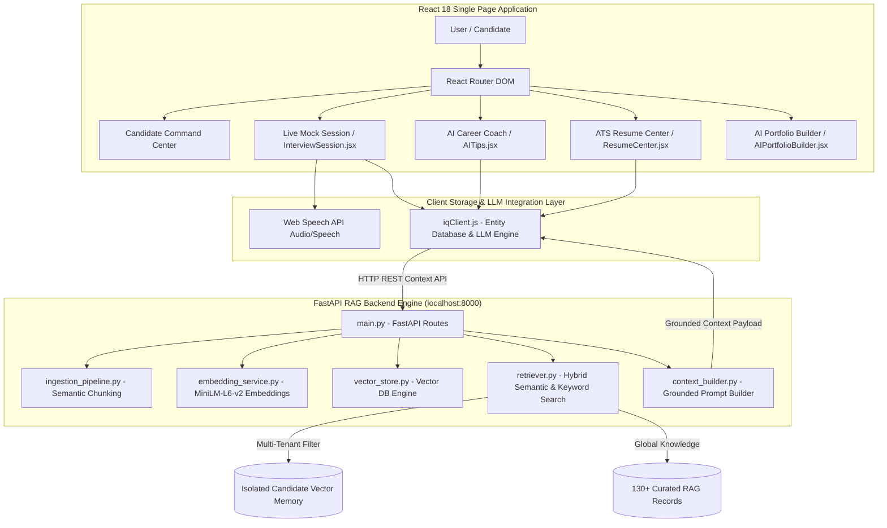

# INTERVIEWIQ AI — COMPLETE PROJECT DOCUMENTATION MANUAL

---

## 1. Executive Summary & System Vision

**InterviewIQ AI** is an enterprise-grade, proctored AI Mock Interview, RAG-grounded Career Coaching, and Resume Intelligence Platform. Designed to bridge the gap between candidate preparation and real-world recruiting standards, InterviewIQ AI leverages state-of-the-art AI technology to deliver personalized, real-time mock interviews, multi-dimensional diagnostics, automated resume parsing, ATS scoring, career roadmapping, and dynamic developer portfolio generation.

The platform combines a **modern React 18 + Vite + Tailwind CSS frontend** with a **Production-Ready Python FastAPI RAG (Retrieval-Augmented Generation) Engine** powered by local vector embeddings (`sentence-transformers/all-MiniLM-L6-v2`) and multi-tenant candidate data isolation.

---

## 2. Problem Statement & Solution

### 2.1 Problem Statement
1. **Lack of Realistic Mock Interview Practice**: Job seekers struggle to find realistic, on-demand interview prep that simulates actual technical, HR, and behavioral interview dynamics with real-time feedback.
2. **Opaque ATS Screening**: Candidates frequently get rejected by Applicant Tracking Systems (ATS) without understanding keyword gaps, formatting issues, or job description alignment score.
3. **Ungrounded AI Hallucinations**: Generic AI chatbots often provide generic, inaccurate, or hallucinated career advice that does not reflect a candidate’s actual past mock history, resume strengths, or industry knowledge bases.
4. **Data Privacy & Multi-Tenant Risk**: In candidate preparation systems, candidate resumes and private session evaluation metrics must never leak across user accounts.

### 2.2 The InterviewIQ AI Solution
1. **Interactive Voice & Video AI Interviewer**: Simulates real-time proctored interviews with speech recognition, audio waveform visualization, webcam eye-tracking, and adaptive question difficulty scaling.
2. **Grounded RAG Engine**: Integrates a 130+ record curated technical & behavioral knowledge base with candidate-isolated vector memories (resumes, past performance reports, target job descriptions).
3. **ATS Resume Intelligence & Job Matching**: Scans resumes, calculates 0–100 ATS compatibility scores, identifies missing critical skills, and builds personalized 4-stage learning roadmaps.
4. **Interactive AI Career Coach**: Delivers punchy, grounded 1–2 sentence career advice grounded in candidate performance history without generic filler.
5. **Multi-Tenant Security & Isolation**: Strict metadata filtering at the vector store layer ensuring Candidate A can never retrieve Candidate B's data.

---

## 3. Technology Stack & Key Libraries Used

### 3.1 Frontend Stack
* **Core Framework**: React 18 SPA initialized with Vite.
* **Styling & Design System**: Tailwind CSS, Vanilla CSS variables, Glassmorphism design tokens.
* **Animation & Motion**: Framer Motion micro-animations, page transition wrappers, glowing ambient background mesh orbs.
* **UI Component Primitives**: Lucide React Icons, Recharts (Radar, Area, Bar charts), Sonner Toasts, React Markdown.
* **Web APIs**: Web Speech API (`SpeechRecognition`, `SpeechSynthesis`), HTML5 MediaDevices (Webcam & Microphone), Web Audio API.

### 3.2 Backend & RAG Stack
* **API Server**: Python 3.14 + FastAPI + Uvicorn ASGI server.
* **Vector Embedding Model**: `sentence-transformers/all-MiniLM-L6-v2` (384-dimensional dense vectors).
* **Vector Store**: High-Speed Memory Vector Database Engine / Qdrant Integration layer.
* **Data Processing & Hashing**: SHA-256 document deduplication, semantic chunking with overlapping windows.
* **Validation & Schemas**: Pydantic v2 data models & FastAPI CORS middleware.

---

## 4. Architecture & System Workflow

---

## 5. RAG (Retrieval-Augmented Generation) Architecture

### 5.1 Architecture Pipeline
1. **Ingestion & Text Cleaning**:
   - Strips redundant formatting, normalizes whitespace, extracts structural metadata.
   - Computes SHA-256 hashes for document deduplication (`doc_hash_1`).
2. **Semantic Chunking**:
   - Splits documents into optimal semantic blocks (~400 characters) with 10% overlap to preserve context across boundaries.
3. **Embedding Generation**:
   - Converts text chunks into 384-dimensional dense vector embeddings using `all-MiniLM-L6-v2`.
4. **Vector Database Storage**:
   - Stores vectors alongside rich metadata payloads: `source_type` (`resume`, `job_description`, `performance`, `knowledge_base`), `candidate_id`, `topic`, `category`, and timestamp.
5. **Hybrid Semantic & Keyword Retrieval**:
   - Calculates cosine similarity score between query vector and index vectors.
   - Applies hybrid re-ranking: `0.7 * Vector Similarity + 0.3 * Exact Keyword Match Score`.
6. **Multi-Tenant Candidate Isolation**:
   - Queries enforced with mandatory `candidate_id` equality check or `source_type == "knowledge_base"`. Candidate A can NEVER inspect Candidate B’s data.
7. **Grounded Prompt Context Builder**:
   - Ranks, deduplicates, and formats top-$K$ blocks into a clean `=== RETRIEVED GROUNDED CONTEXT ===` payload injected directly into LLM prompts.

### 5.2 RAG Knowledge Base Dataset
* **Dataset File**: `InterviewIQ_RAG_Dataset.zip` (indexed on backend startup).
* **Volume**: ~130 curated interview-knowledge records across 15 domain categories.
* **Covered Domains**: React, JavaScript, Python, Data Structures & Algorithms (DSA), DBMS & SQL, MongoDB, System Design, Operating Systems, Computer Networks, AI/ML, HR & Behavioral STAR Frameworks.

---

## 6. Multi-Agent System Architecture

InterviewIQ AI incorporates 5 specialized AI agents working synchronously across the application:

1. **AI Technical Interviewer Agent**:
   - *Responsibility*: Generates adaptive, multi-category (Technical, HR, Behavioral) questions based on candidate profile, target role, and past performance.
   - *Key Tech*: Contextual LLM prompt synthesis, dynamic difficulty scaling, speech output synthesis.
2. **AI Evaluator & Diagnostic Agent**:
   - *Responsibility*: Evaluates candidate transcripts across 7 distinct dimensions (Technical Depth, Communication, Confidence, Fluency, Grammar, HR Fit, Overall Grade).
   - *Key Tech*: Scoring algorithms, STAR framework compliance analysis, WPM pacing analyzer.
3. **ATS Resume & Job Matching Agent**:
   - *Responsibility*: Parses candidate resumes, calculates 0–100 ATS compatibility scores, identifies missing keywords, and designs 4-stage career learning roadmaps.
   - *Key Tech*: Skill extraction, fuzzy keyword matching, timeline generator.
4. **AI Career Coach Agent**:
   - *Responsibility*: Answers candidate questions in real-time, delivering 1–2 sentence actionable tips grounded in RAG performance memory without JSON artifacts.
   - *Key Tech*: RAG context retrieval, question intent classification, output sanitization.
5. **AI Portfolio Generation Agent**:
   - *Responsibility*: Transforms candidate resume, skills, and mock accomplishments into fully responsive, downloadable developer portfolio websites.
   - *Key Tech*: HTML/CSS template generation, theme switching engine.

---

## 7. Comprehensive Page-by-Page Documentation

### 7.1 Landing Page (`Landing.jsx`)
* **Route**: `/` (Public)
* **Description**: High-converting marketing landing page presenting platform capabilities.
* **Key Functions**:
  - Hero banner with CTA leading to candidate dashboard or registration.
  - Interactive feature cards explaining Voice AI, ATS Scanner, RAG Knowledge Base, and Portfolio Builder.
  - Customer testimonials, live platform statistics, and interactive FAQ accordion.

### 7.2 Authentication System (`Login.jsx`, `Register.jsx`, `ForgotPassword.jsx`, `ResetPassword.jsx`)
* **Routes**: `/login`, `/register`, `/forgot-password`, `/reset-password` (Public)
* **Description**: Secure candidate authentication and credential recovery.
* **Key Functions**:
  - One-click "Quick Demo Login" button (`demo@interviewiq.ai`).
  - Real-time form validation with Sonner toast notifications.
  - Local database user registration and session management in `localStorage`.

### 7.3 Candidate Onboarding Wizard (`Onboarding.jsx`)
* **Route**: `/onboarding` (Protected)
* **Description**: 4-step profile wizard for first-time candidate setup.
* **Key Functions**:
  - Captures full name, target job role (e.g. Data Analyst, Frontend Engineer), experience level, target salary, and core skills.
  - Ingests initial candidate metadata into `iqClient.entities.UserProfile`.

### 7.4 Candidate Command Center (`Dashboard.jsx`)
* **Route**: `/dashboard` (Protected)
* **Description**: Candidate main hub displaying daily progress, metrics, and shortcuts.
* **Key Functions**:
  - **Welcome Banner**: Personal greeting and daily interview quota tracker (max 10/day).
  - **Stats Cards Component (`StatsCards.jsx`)**: Displays 6 key metric cards (Completed Rounds, Best Score, Technical Avg, Communication Avg, Confidence Avg, Quota Remaining).
  - **Performance Analytics Chart (`PerformanceCharts.jsx`)**: Interactive Recharts area chart plotting score progression over time.
  - **ATS Summary Widget**: Highlights latest resume score and skill gaps with quick link to Resume Center.
  - **Recent Practice Archives**: Displays the last 3 completed mock interviews with instant diagnostic report links.

### 7.5 Real-Time AI Proctored Interview Room (`InterviewSession.jsx`)
* **Route**: `/interview` (Distraction-Free Proctored Layout)
* **Description**: Live mock interview room simulating actual company interviews.
* **Key Functions**:
  - **Live Web Camera Feed & Eye Tracking**: Monitors candidate video feed and focus stability.
  - **Voice-to-Text Recognition**: Transcribes candidate spoken answers in real-time via Web Speech API.
  - **Audio Waveform Visualizer**: Dynamic volume wave bars reflecting speech input volume.
  - **Adaptive Question Delivery**: Delivers role-specific questions generated by the AI Interviewer Agent.
  - **Auto-Submission**: Ingests session performance report into RAG backend (`ingestPerformance`) upon completion and redirects to feedback report.

### 7.6 Comprehensive Feedback Diagnostic Report (`FeedbackReport.jsx`)
* **Route**: `/feedback/:interviewId` (Protected)
* **Description**: Full post-interview diagnostic evaluation report.
* **Key Functions**:
  - **Overall Score Card**: Letter Grade (A+, A, B, C) and overall score percentage.
  - **Radar & Bar Charts**: Visual breakdown across Technical, Communication, Confidence, and HR dimensions.
  - **Question-by-Question Breakdown**: Candidate answer vs. ideal STAR framework answer with category score.
  - **Delivery Speed Gauge**: Words Per Minute (WPM) gauge and eye contact stability score.
  - **PDF Export & Email Sharing**: Downloads PDF report or emails diagnostic report via Web3Forms API.

### 7.7 Practice Session Archives (`InterviewHistory.jsx`)
* **Route**: `/history` (Protected)
* **Description**: Searchable repository of all completed mock sessions.
* **Key Functions**:
  - Real-time search and filtering by role, score grade, or date.
  - Direct links to View Report, Replay Audio/Transcript, or Delete Session.

### 7.8 Session Audio & Transcript Replay (`InterviewReplay.jsx`)
* **Route**: `/replay/:interviewId` (Protected)
* **Description**: Interactive replay timeline of completed interview sessions.
* **Key Functions**: Synchronized audio and transcript player with inline question-by-question AI notes.

### 7.9 ATS Resume Scanner & Optimizer (`ResumeCenter.jsx`)
* **Route**: `/resume` (Protected)
* **Description**: Resume text extractor and ATS compatibility scanner.
* **Key Functions**:
  - Drag-and-drop PDF/Docx parser extracting raw resume text.
  - Calculates 0–100 ATS score against target job roles.
  - Highlights matched keywords vs. missing critical technical skills.
  - Generates 5 custom technical interview questions based on candidate resume experience.
  - Automatically ingests resume text into RAG backend (`ingestResume`) with candidate isolation.

### 7.10 AI Career Coach & STAR Advisor (`AITips.jsx`)
* **Route**: `/tips` (Protected)
* **Description**: RAG-grounded real-time AI career coach chat.
* **Key Functions**:
  - Retrieves grounded candidate RAG context (`buildContext`).
  - Answers candidate questions in 1–2 sentences covering technical weaknesses, resume skills to highlight, mock session gaps, behavioral STAR methods, gap years, and salary negotiation.
  - Ensures clean natural language delivery without raw JSON artifact dumps.

### 7.11 Smart Job Matching & Career Roadmaps (`JobMatching.jsx`)
* **Route**: `/jobs` (Protected)
* **Description**: AI job compatibility scanner and career roadmap generator.
* **Key Functions**:
  - Displays match percentage for target software roles.
  - Generates 4-stage learning roadmaps (Foundation, Core, Advanced, Mastery) with skill tags and curated learning resources.

### 7.12 AI Developer Portfolio Builder (`AIPortfolioBuilder.jsx` & `PortfolioPreview.jsx`)
* **Routes**: `/portfolio`, `/portfolio-preview` (Protected / Public)
* **Description**: Developer portfolio website generator.
* **Key Functions**:
  - Themes: Glassmorphic Dark, Sleek Minimal, Electric Neon, Light Studio.
  - Auto-fills bio, skills, project cards, and interview badges from candidate profile.
  - Generates shareable public link and downloadable HTML bundle.

### 7.13 Global Candidate Leaderboard (`Leaderboard.jsx`)
* **Route**: `/leaderboard` (Protected)
* **Description**: Platform rankings celebrating top candidate scores.
* **Key Functions**: Gold 🥇, Silver 🥈, Bronze 🥉 badges, ranking table, obfuscated candidate emails, and streak tracking.

### 7.14 Candidate Profile & Application Settings (`Profile.jsx`, `SettingsPage.jsx`)
* **Routes**: `/profile`, `/settings` (Protected)
* **Description**: Account settings and preference controls.
* **Key Functions**:
  - **Dual-Theme Switcher (`ThemeToggle.jsx`)**: Toggles between Dark Mode (`#0B0C16`) and LIVIQ Light Mode (`#F4F7F0`).
  - **Voice Controls (`VoiceSettings.jsx`)**: Configures speech synthesis voice, rate, and pitch.
  - **Email Reminders (`ReminderSettings.jsx`)**: Configures automated daily practice reminders via Web3Forms.

---

## 8. Team Contribution & Role Distribution (5 Members)

| Member | Role / Focus Area | Website Pages | AI Agents & RAG Components | Core Concepts |
| :--- | :--- | :--- | :--- | :--- |
| **Member 1** | Voice & Mock Interview Engine Lead | `/interview` (InterviewSession.jsx) | AI Technical Interviewer Agent, Voice Synthesis Engine | Adaptive Interviewing, Web Speech API, Audio Waveform Visualizers |
| **Member 2** | RAG Backend & Vector DB Architect | `/rag-status` (FastAPI Console) | Semantic Search Agent, Grounded Context Builder, Vector Store | RAG Architecture, Sentence-Transformers, Multi-Tenant Data Isolation |
| **Member 3** | ATS Resume & Job Matching Lead | `/resume` (ResumeCenter.jsx), `/jobs` (JobMatching.jsx) | ATS Resume Parser Agent, Career Roadmap Agent | ATS Scoring Algorithms, Skill Gap Analysis, Learning Roadmaps |
| **Member 4** | Analytics, Reports & Leaderboard Lead | `/feedback/:id` (FeedbackReport.jsx), `/history`, `/leaderboard` | Multi-Dimensional Evaluator Agent, Resource Recommendation Agent | Multi-Metric Scoring, Diagnostic Radar Charts, Candidate Analytics |
| **Member 5** | AI Career Coach, Portfolio & System UX Lead | `/tips` (AITips.jsx), `/portfolio` (AIPortfolioBuilder.jsx), `/dashboard` | AI Career Coach Agent, AI Portfolio Generator Agent | Dual-Theme Engine (Dark/LIVIQ Light), Glassmorphism UI, Prompt Engineering |

---

## 9. Verification & Testing Suite

* **RAG Pipeline Test Suite (`test_rag_pipeline.py`)**: 11/11 tests passing (text cleaning, chunking, metadata generation, vector dimension, multi-tenant candidate isolation, duplicate hashing, context building, error handling).
* **RAG Dataset Retrieval Suite (`test_dataset_retrieval.py`)**: 10/10 test queries passing across all 15 knowledge categories.
* **Full RAG Integration Suite (`test_full_integration.py`)**: 6/6 tests passing.
* **Frontend Production Build (`npm run build`)**: 0 errors, clean Vite bundle build.

---
*Document updated and verified for InterviewIQ AI repository.*
